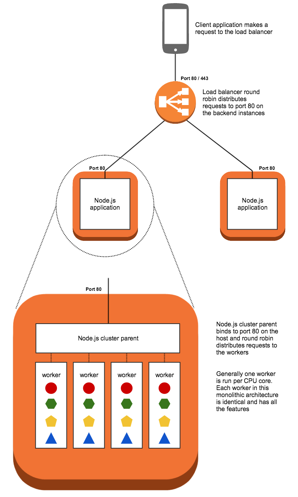

## Basic Node.js Server

This is an example of a basic monolithic node.js service that has been designed to run directly on a server, without a container.

### Architecture

Since Node.js programs run a single threaded event loop it is necessary to use the node `cluster` functionality in order to get maximum usage out of a multi-core server.

In this example `cluster` is used to spawn one worker process per core, and the processes share a single port using round robin load balancing built into Node.js

We can use an Application Load Balancer to round robin requests across multiple servers, providing horizontal scaling.

