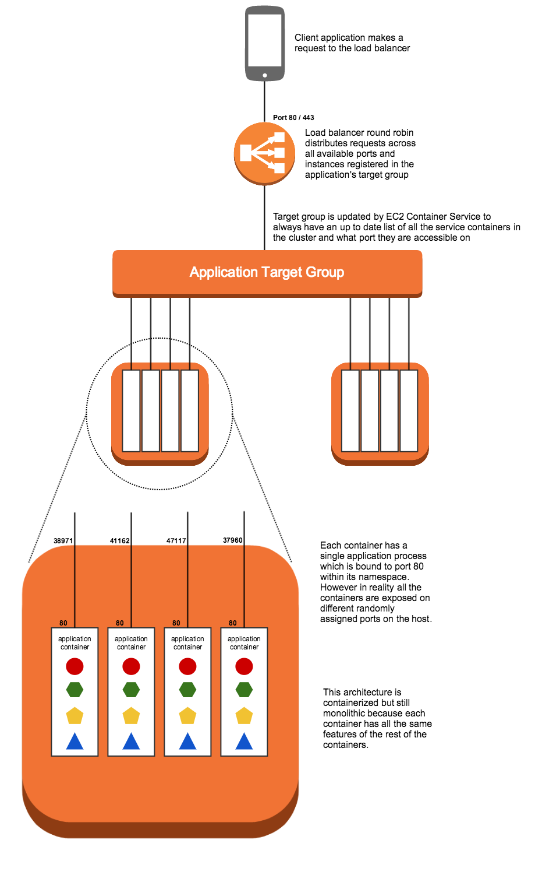

## Deploying in containers

In this example we take our node application and put it into a container for deployment on EC2 Container Service.



### Why containers?

__Dependency Control__: Containers wrap application code in a unit of deployment that captures a snapshot of the code as well as its dependencies, which solves a few problems:

- The version of `node` on a local developer's machine may not match the version on the production servers, or the version on the CI server, allowing developers to ship code that runs locally but fails in production. On the other hand a container will ship with a specific version of node included.
- If `package.json` dependencies aren't rigorously shrinkwrapped then `npm install` may end up installing different package versions locally, on a CI server, and on the production servers. Containers solve this by including all the npm dependencies with the application code.
- Even if dependencies are locked down using a shrinkwrap file a particular package you depend on [may be unavailable, or removed](http://blog.npmjs.org/post/141577284765/kik-left-pad-and-npm). If this happens it doesn't stop a container from working, because the container still has a copy of the package from the moment that the container was built.

__Improved Pipeline__: The container also allows an engineering organization to create a standard pipeline for the application lifecycle. For example:

1. Developers build and run container locally.
2. CI server runs the same container and executes integration tests against it to make sure it passes expectations.
3. Same container is shipped to a staging environment where its runtime behavior can be checked using load tests or manual QA.
4. Same container is finally shipped to production.

Being able to ship the exact same container through all four stages of the process makes delivering a high quality, reliable application considerably easier.

__No mutations to machines:__ When applications are deployed directly onto instances you run the risk of a bad deploy corrupting an instance configuration in a way that is hard to recover from. For example imagine a deployed application which requires some custom configurations in `/etc`. This can become a very fragile deploy as well as one that is hard to roll back if needed. However with a containerized application the container carries its own filesystem with its own `/etc` and any custom configuration changes that are part of this container will be sandboxed to that application's environment only. The underlying instance's configurations stay the same. In fact a container can't even make persistant filesystem changes without an explicit mounted volume which grants the container access to a limited area on the host instance.

## Why EC2 Container Service?

EC2 Container Service provides orchestration for your containers. It automates the process of launching containers across your fleet of instances according to rules your specify, then automates keeping track of where those containers are running so that you can use a load balancer to get traffic to them. It also has built in features to roll out deploys with zero downtime, gather metrics and logs from your containers, and auto scale the number of containers you are running based on metrics.

## Application Changes for Docker

1. __Single process instead of `cluster`.__ The first and biggest change involved with containerizing this application is getting rid of `cluster`. With docker containers the goal is to run a single process per container, rather than a cluster of processes.

   The reason for this change is that a lighweight container with a single process in it allows for greater granularity and flexibility in container placement onto infrastructure. A large container that has four processes in it and requires four cores of CPU power can only be run on an instance of a particular size. However by breaking that up into four containers that each have a single process in them we can now make use of two smaller instances that will each run two containers, or even four tiny instances that will each run a single container. Or we could go the opposite direction and easily run 64 of these small containers on a single massive instance.

2. __Create `Dockerfile`:__ This file is basically a build script that creates the container. The base container that the dockerfile starts from contains a specific version of node.js. Then the rest of the commands add both the application code and the `node_modules` folder into the container. The result is a container image that is a reliable unit of deployment. The container can be run locally, or run on a remote server. It will run the same in both places.

## Deployment

1. Launch an ECS cluster using the Cloudformation template:

   ```
   $ aws cloudformation deploy \
   --template-file infrastructure/ecs.yml \
   --region <region> \
   --stack-name <stack name> \
   --capabilities CAPABILITY_NAMED_IAM
   ```

2. Deploy the services onto your cluster: 

   ```
   $ ./deploy.sh <region> <stack name>
   ```
